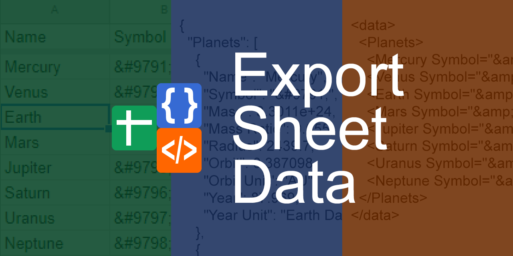

Export Sheet Data is an add-on for Google Sheets that allows sheets to be exported as JSON or XML.

Goals
-----
**Convenient:** Export Sheet Data is meant to be simple to use but very powerful. No more exporting multiple CSVs then compiling data.

**Customizable:** Options and formats can be tweaked to reflect personal taste. Default or stringified values for JSON. Attributes or child elements for XML. Format your data the way you want.

Install
-------
Export Sheet Data is available in both the Chrome Web Store and the G Suite Marketplace. You can install it [here](https://chrome.google.com/webstore/detail/export-sheet-data/bfdcopkbamihhchdnjghdknibmcnfplk?utm_source=permalink)

**NOTE:** There is a known bug when using add-ons while multiple accounts are signed in. If you run into a situation where the ESD sidebar doesn't seem to load, visit the [troubleshooting](docs/troubleshooting.md) page for help.

Documentation
-------------
The best way to figure out how to use Export Sheet Data is by opening the sidebar, reading the tooltips of various options and experimenting with the output using the Visualize option.

For detailed documentation on each option, take a look at [Export Sheet Data's documentation](https://github.com/Synthoid/ExportSheetData/blob/master/docs/index.md).

If you want to create more advanced data structures, make sure to read the Wiki page about [Nested Elements](https://github.com/Synthoid/ExportSheetData/wiki/Nested-Elements).

Development Status
------------------
Export Sheet Data supports a wide variety of features. Currently, this includes:

**JSON**
* Forcing all data to string values
* Exporting individual cells as JSON arrays
* Exporting a sheet's contents as an array of JSON objects
* Creating complex data structures via Nested Elements

**XML**
* Exporting columns as attributes, child elements, or inner text of a row
* Automatic formatting of XML illegal characters like `&`, `<`, and `>`
* XML comments and declaration support
 
**General**
* Visualize data before exporting
* Exporting specific sheets
* Unwrapping or collapsing a sheet's data for easier access after exporting
* Minifying exported data to produce smaller files
 
Contributing
------------
If you would like to add a feature to Export Sheet Data, be sure to read the [wiki page on contributing](https://github.com/Synthoid/ExportSheetData/wiki/Contributing). Also, take a look at the [notes on project structure](https://github.com/Synthoid/ExportSheetData/wiki/Project-Structure) and check out the [currently open issues](https://github.com/Synthoid/ExportSheetData/issues).

Credits
-------
Developed by Chris Ingerson with help from the community.

- Ignore rows support added by [jaeki-kim](https://github.com/jaeki-kim)
- Visualization window HTML escaping added by [tomyam1](https://github.com/tomyam1)
- Settings bug fixes by [pvirdone-s8](https://github.com/pvirdone-s8)

License
-------
Export Sheet Data is licensed under the MIT License, see [LICENSE](https://github.com/Synthoid/ExportSheetData/blob/master/LICENSE) for more information.
