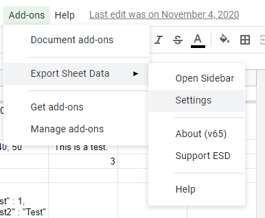
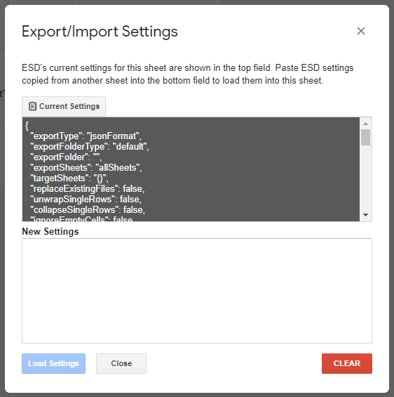

Importing and Exporting ESD Settings
------------------------------------
As of v65, ESD supports exporting and importing settings via JSON strings. This is handled by the settings menu, which can be opened by selecting the "Settings" menu item:

This will open the settings menu. Here, you can see the current documents settings (if ESD has exported or visualized data) which can be copied and pasted into the bottom text area in another document to import the settings used by ESD in the current document.

