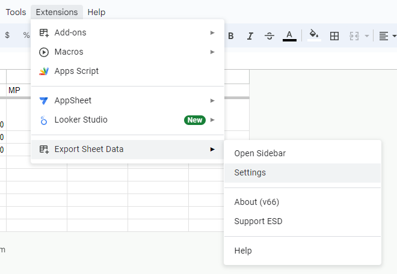

Importing and Exporting ESD Settings
------------------------------------
As of v65, ESD supports exporting and importing settings via JSON strings. This is handled by the settings menu, which can be opened by selecting the "Settings" menu item:

This will open the settings menu. Here, you can see the current documents settings (if ESD has exported or visualized data) which can be copied and pasted into the bottom text area in another document to import the settings used by ESD in the current document.

Once you have pasted a settings JSON blob into the bottom field, you can click the `Load Settings` button to import those settings into the current document. Doing so will refresh the current settings and reopen the sidebar. *Specific sheets targeted when [Export sheets](format/exportsheets.md) is set to custom are not imported with the rest of the settings.* This is because different spreadsheets may have different IDs for targeted sheets so their saved export values may be incorrect.

You can also clear the current settings for the document. ***This cannot be undone, so you will have to adjust or load settings again once `Clear` has been clicked. Use this with caution.***
